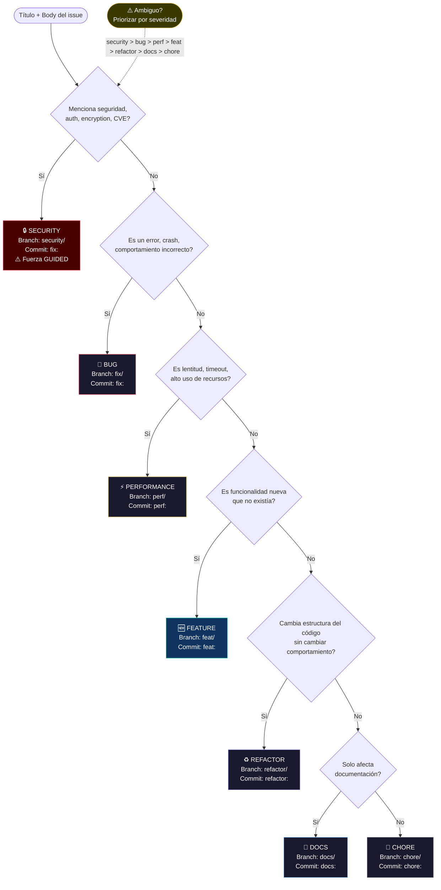
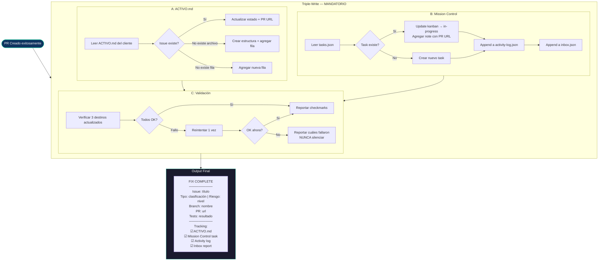
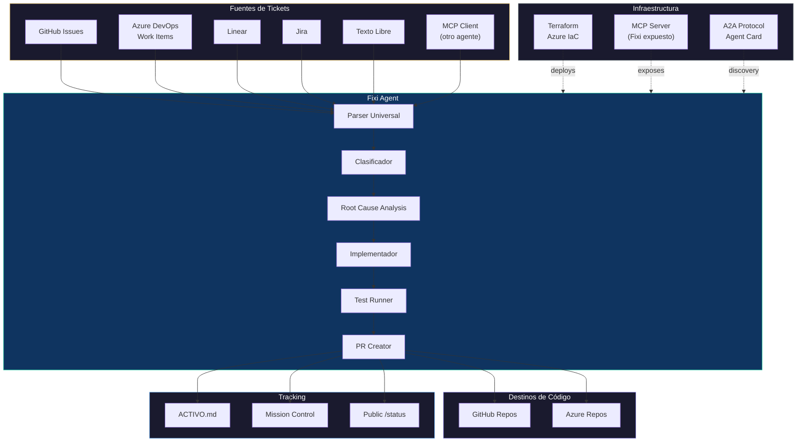

# Diagramas — Fixi Agent

> Diagramas Mermaid del flujo operacional de Fixi.
> Ver también: [Workflow de 10 pasos](../skill/SKILL.md), [Taxonomía de clasificación](../skill/references/classification.md), [Reglas de seguridad](../skill/references/guardrails.md), [Roadmap](PLAN.md), [Especificación técnica](SPEC.md)

---

## 1. Flujo Principal: Issue → PR

Ciclo completo de resolución de un ticket en 10 pasos.
Ver detalle en [skill/SKILL.md](../skill/SKILL.md).

```mermaid
flowchart TD
    START([📥 Issue recibido]) --> P0

    subgraph P0["Paso 0 — Safety Gate"]
        P0A[Verificar pwd ≠ consultoria-x]
        P0B[Verificar repo git válido]
        P0C[Verificar working tree limpio]
        P0D[Identificar cliente]
        P0E[Leer convenciones locales]
        P0F[Verificar remote]
        P0A --> P0B --> P0C --> P0D --> P0E --> P0F
    end

    P0 -->|ABORT si falla| ABORT([ABORT + Rollback])
    P0 -->|OK| P1

    subgraph P1["Paso 1 — Parsear Solicitud"]
        P1A{Formato del input?}
        P1A -->|github.com/.../issues/N| P1B[gh issue view]
        P1A -->|#N o GH-N| P1C[gh issue view shorthand]
        P1A -->|linear.app/...| P1D[WebFetch Linear]
        P1A -->|atlassian.net/...| P1E[WebFetch Jira]
        P1A -->|dev.azure.com/...| P1F[az boards work-item show]
        P1A -->|Texto libre| P1G[Usar directo + generar ID]
        P1B & P1C & P1D & P1E & P1F & P1G --> P1H[Normalizar solicitud]
    end

    P1 --> P2

    subgraph P2["Paso 2 — Clasificar"]
        P2A[Analizar keywords en título + body]
        P2B{Tipo detectado}
        P2A --> P2B
        P2B --> P2C[bug / feature / refactor / security / performance / docs / chore]
        P2C --> P2D[Asignar branch prefix + commit prefix]
        P2D --> P2E[Calcular confianza: ALTA / MEDIA / BAJA]
    end

    P2 --> P3

    subgraph P3["Paso 3 — Nivel de Autonomía"]
        P3A{Usuario eligió nivel?}
        P3A -->|Default| P3B[GUIDED — aprobación en cada paso]
        P3A -->|"rápido" / "auto"| P3C[CONFIRM_PLAN — un OK ejecuta todo]
        P3A -->|"full auto"| P3D[FULL_AUTO — sin interrupciones]
        P3B & P3C & P3D --> P3E{Escaladores activos?}
        P3E -->|Security / Migrations / CI-CD / >15 files / Ambiguo| P3F[Forzar GUIDED]
        P3E -->|No| P3G[Continuar con nivel elegido]
    end

    P3 --> P4

    subgraph P4["Paso 4 — Root Cause Analysis"]
        P4A[Entender arquitectura del repo]
        P4B[Keyword search en codebase]
        P4C[Stack trace analysis]
        P4D[Dependency tracing]
        P4E[Examinar tests existentes]
        P4A --> P4B --> P4C --> P4D --> P4E
        P4E --> P4F[Formular hipótesis: QUÉ + DÓNDE + POR QUÉ + CÓMO]
    end

    P4 -->|Causa no encontrada en ~10 min| ESCALATE([Escalar al usuario])
    P4 -->|Hipótesis formulada| P5

    subgraph P5["Paso 5 — Crear Branch"]
        P5A[Detectar branch default]
        P5B[Generar nombre: prefix/external_id-slug]
        P5C["git checkout -b {branch}"]
        P5A --> P5B --> P5C
    end

    P5 --> P6

    subgraph P6["Paso 6 — Implementar Fix"]
        P6A[Cambio mínimo necesario]
        P6B[Respetar convenciones del repo]
        P6C[Ejecutar linter si existe]
        P6D[Commit convencional por cambio lógico]
        P6A --> P6B --> P6C --> P6D
    end

    P6 --> P7

    subgraph P7["Paso 7 — Tests"]
        P7A[Detectar test runner]
        P7B[Ejecutar tests]
        P7C{Resultado?}
        P7B --> P7C
        P7A --> P7B
        P7C -->|Pass| P7D[Continuar]
        P7C -->|Fail nuestro código| P7E[Arreglar + re-commit]
        P7C -->|Fail pre-existente| P7F[Documentar en PR]
        P7C -->|No hay tests| P7G[Notar en PR]
        P7E --> P7B
    end

    P7 --> P8

    subgraph P8["Paso 8 — Crear PR"]
        P8A[git push -u origin branch]
        P8B[Crear PR con template completo]
        P8C[Issue + Clasificación + Root Cause + Cambios + Testing]
        P8A --> P8B --> P8C
    end

    P8 --> P9

    subgraph P9["Paso 9 — Triple-Write Tracking"]
        P9A[Actualizar ACTIVO.md del cliente]
        P9B[Actualizar tasks.json en Mission Control]
        P9C[Append a activity-log.json]
        P9D[Append a inbox.json]
        P9A & P9B & P9C & P9D --> P9E[Validar triple-write]
    end

    P9 --> P10

    subgraph P10["Paso 10 — Cleanup"]
        P10A{Todo OK?}
        P10A -->|Sí| SUCCESS([FIX COMPLETE — PR listo para review])
        P10A -->|No| ROLLBACK([Rollback: eliminar branch + reportar fallo])
    end

    style START fill:#1a1a2e,stroke:#e94560,color:#fff
    style SUCCESS fill:#0f3460,stroke:#16c79a,color:#fff
    style ABORT fill:#4a0000,stroke:#e94560,color:#fff
    style ROLLBACK fill:#4a0000,stroke:#e94560,color:#fff
    style ESCALATE fill:#3a3a00,stroke:#e9c46a,color:#fff
```

---

## 2. Árbol de Clasificación

Lógica de decisión para determinar el tipo de issue.
Ver detalle en [Taxonomía completa](../skill/references/classification.md).



---

## 3. Niveles de Autonomía

Cómo Fixi adapta su comportamiento según el nivel elegido.
Ver detalle en [Paso 3 del workflow](../skill/SKILL.md).

```mermaid
flowchart LR
    subgraph LEVELS["Niveles de Autonomía"]
        direction TB

        GUIDED["**GUIDED** (Default)<br/>─────────────<br/>Aprobación en cada paso:<br/>• Clasificación<br/>• Plan de fix<br/>• Cada archivo modificado<br/>• PR<br/>• Tracking"]

        CONFIRM["**CONFIRM_PLAN**<br/>─────────────<br/>Activación: 'rápido' / 'auto'<br/>• Presenta plan completo<br/>• Un solo OK<br/>• Ejecuta todo sin parar"]

        FULLAUTO["**FULL_AUTO**<br/>─────────────<br/>Activación: 'full auto'<br/>• Sin interrupciones<br/>• Parseo → PR directo<br/>• Máxima velocidad"]
    end

    GUIDED -->|"Usuario dice 'rápido'"| CONFIRM
    CONFIRM -->|"Usuario dice 'full auto'"| FULLAUTO
    FULLAUTO -->|"Usuario dice 'para'"| GUIDED

    subgraph ESCALATORS["Escaladores Automáticos → Fuerzan GUIDED"]
        direction TB
        E1["Issue toca auth / payments / encryption"]
        E2["Requiere DB migrations"]
        E3["Modifica CI/CD pipelines"]
        E4["Root cause afecta >15 archivos"]
        E5["Causa raíz ambigua"]
    end

    ESCALATORS -->|"Override automático"| GUIDED

    style GUIDED fill:#0f3460,stroke:#16c79a,color:#fff
    style CONFIRM fill:#1a1a2e,stroke:#e9c46a,color:#fff
    style FULLAUTO fill:#1a1a2e,stroke:#e94560,color:#fff
    style ESCALATORS fill:#4a0000,stroke:#e94560,color:#fff
```



---

## 4. Flujo de Triple-Write (Tracking)

Actualización obligatoria en 3 destinos después de cada fix.
Ver detalle en [Paso 9 del workflow](../skill/SKILL.md), [Regla de tracking](../skill/references/guardrails.md).



---

## 5. Arquitectura de Integración (Vista GlobalMVM)

Cómo Fixi se conecta con diferentes fuentes y destinos.
Ver también: [Fase 6 — Ecosistema](PLAN.md), [Backlog de desarrollo](planning/BACKLOG.md)


